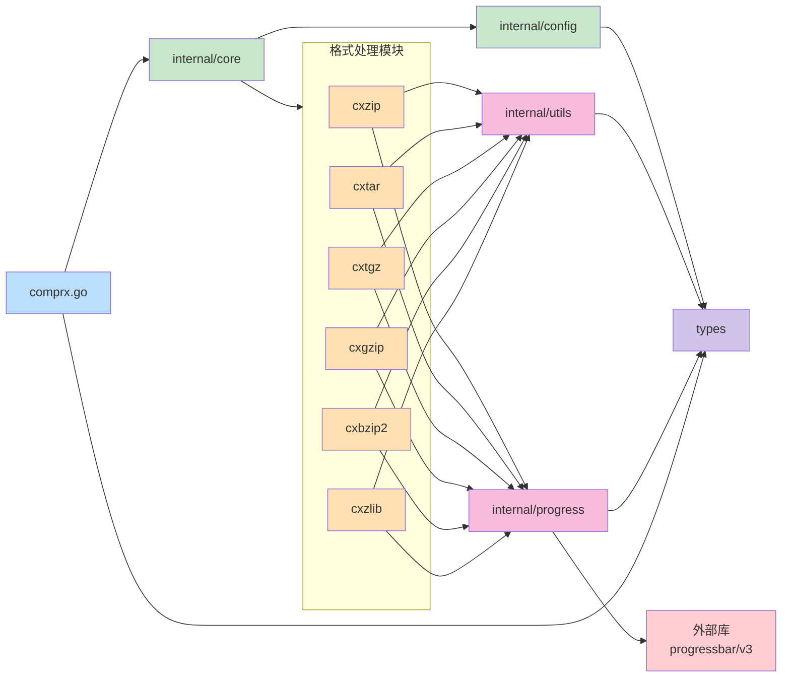

# Comprx 压缩库架构图

## 整体架构

```mermaid
graph TB
    %% 用户接口层
    subgraph "用户接口层 (Public API)"
        API[comprx.go<br/>统一API接口]
        API --> Pack[Pack/PackProgress<br/>压缩函数]
        API --> Unpack[Unpack/UnpackProgress<br/>解压函数]
        API --> Options[PackOptions/UnpackOptions<br/>配置化函数]
        API --> Specific[UnpackFile/UnpackDir/UnpackMatch<br/>特定解压函数]
    end

    %% 核心层
    subgraph "核心层 (Core Layer)"
        Core[internal/core/comprx.go<br/>核心压缩器]
        Core --> CorePack[Pack方法<br/>格式检测与分发]
        Core --> CoreUnpack[Unpack方法<br/>格式检测与分发]
    end

    %% 配置层
    subgraph "配置层 (Configuration)"
        Config[internal/config/<br/>配置管理]
        Config --> CompLevel[压缩等级配置]
        Config --> Progress[进度条配置]
        Config --> Filter[过滤器配置]
    end

    %% 格式处理层
    subgraph "格式处理层 (Format Handlers)"
        ZIP[internal/cxzip/<br/>ZIP处理]
        TAR[internal/cxtar/<br/>TAR处理]
        TGZ[internal/cxtgz/<br/>TGZ处理]
        GZIP[internal/cxgzip/<br/>GZIP处理]
        BZIP2[internal/cxbzip2/<br/>BZIP2处理]
        ZLIB[internal/cxzlib/<br/>ZLIB处理]
    end

    %% 工具层
    subgraph "工具层 (Utilities)"
        Utils[internal/utils/<br/>通用工具]
        Utils --> Buffer[缓冲区管理]
        Utils --> Size[大小计算]
        Utils --> Validate[路径验证]
        Utils --> FileOps[文件操作]
    end

    %% 进度条层
    subgraph "进度条层 (Progress)"
        ProgressPkg[internal/progress/<br/>进度条管理]
        ProgressPkg --> ProgressBar[进度条显示]
        ProgressPkg --> SizeCalc[大小计算]
    end

    %% 类型定义层
    subgraph "类型定义层 (Types)"
        Types[types/<br/>类型定义]
        Types --> FilterTypes[过滤器类型]
        Types --> CompressTypes[压缩格式类型]
        Types --> ProgressTypes[进度条类型]
        Types --> ListTypes[列表类型]
    end

    %% 连接关系
    API --> Core
    Core --> Config
    Core --> ZIP
    Core --> TAR
    Core --> TGZ
    Core --> GZIP
    Core --> BZIP2
    Core --> ZLIB
    
    ZIP --> Utils
    TAR --> Utils
    TGZ --> Utils
    GZIP --> Utils
    BZIP2 --> Utils
    ZLIB --> Utils
    
    ZIP --> ProgressPkg
    TAR --> ProgressPkg
    TGZ --> ProgressPkg
    GZIP --> ProgressPkg
    BZIP2 --> ProgressPkg
    ZLIB --> ProgressPkg
    
    Config --> Types
    Utils --> Types
    ProgressPkg --> Types
    
    %% 外部依赖
    ProgressPkg --> ExtProgress[github.com/schollz/progressbar/v3<br/>外部进度条库]

    %% 样式定义
    classDef apiLayer fill:#e1f5fe
    classDef coreLayer fill:#f3e5f5
    classDef configLayer fill:#e8f5e8
    classDef formatLayer fill:#fff3e0
    classDef utilLayer fill:#fce4ec
    classDef progressLayer fill:#f1f8e9
    classDef typeLayer fill:#e0f2f1
    classDef external fill:#ffebee

    class API,Pack,Unpack,Options,Specific apiLayer
    class Core,CorePack,CoreUnpack coreLayer
    class Config,CompLevel,Progress,Filter configLayer
    class ZIP,TAR,TGZ,GZIP,BZIP2,ZLIB formatLayer
    class Utils,Buffer,Size,Validate,FileOps utilLayer
    class ProgressPkg,ProgressBar,SizeCalc progressLayer
    class Types,FilterTypes,CompressTypes,ProgressTypes,ListTypes typeLayer
    class ExtProgress external
```

## 数据流图

## 模块依赖关系

## 关键特性

### 支持的压缩格式
- **ZIP**: .zip 文件的压缩和解压
- **TAR**: .tar 文件的压缩和解压
- **TGZ**: .tgz, .tar.gz 文件的压缩和解压
- **GZIP**: .gz 文件的压缩和解压
- **BZIP2**: .bz2, .bzip2 文件的解压（仅支持解压）
- **ZLIB**: .zlib 文件的压缩和解压

### 核心功能
- **自动格式检测**: 根据文件扩展名自动选择合适的处理器
- **进度条支持**: 可选的进度条显示，支持多种样式
- **文件过滤**: 支持包含/排除模式、文件大小过滤
- **线程安全**: 所有操作都是线程安全的
- **配置化**: 灵活的配置选项，支持压缩等级、覆盖设置等
- **错误处理**: 完善的错误处理和参数验证

### 设计模式
- **策略模式**: 不同压缩格式使用不同的处理策略
- **工厂模式**: 根据文件格式创建对应的处理器
- **配置模式**: 统一的配置管理
- **适配器模式**: 统一的API接口适配不同的压缩库